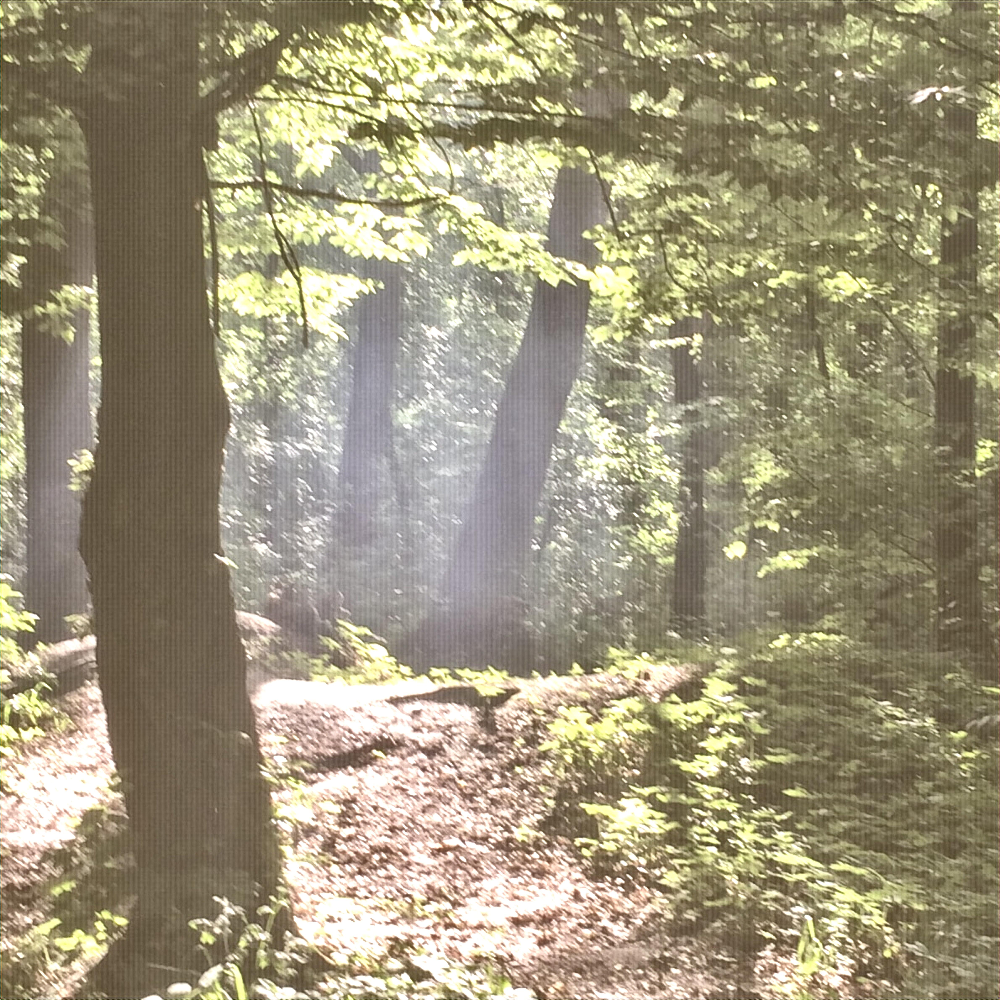

# SuresAI 

---
## About The app
SuperResolution is a Python application for enhancing the resolution of images using the 
**EDSR (Enhanced Deep Super-Resolution)** model. It supports a command-line interface
and tile-based processing for handling large images efficiently.

---
## Technologies
- Python 3.13
- pillow
- Pytorch
- numpy

## Features
- Support Dataset learning
- Each photo in low-resolution_photos folder has been improved
---

## Original image (1,190x1,190 JPEG (24-bit color) 568,37 kB)


## Improved image (4,760x4,760 JPEG (24-bit color) 2,73 MB)


## In developing 
- support png format
- full quality histogram equalization

---

## Installing the application via GitHub
```bash
git clone  https://github.com/olefinbrabus/PopCornCinema
cd PopCornCinema
python3 -m venv venv
pip install -r requirements.txt
```
---
## Usage
1. Transfer all the necessary photos to folder low-resolution_photos
2. Launch application:

```bash
python main.py
```

3. await photos
4. enjoy your photos :)